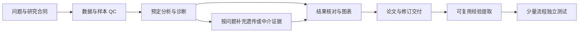

# Multi-Omics Research Workflow

**从研究问题到可追溯交付：公共卫生、流行病学与多组学研究的可复用工作流程。**

A practical workflow library for auditable research, with focused agent skills, reusable playbooks, and a clean project starter.

本仓库将多种基于UKB多组学分析项目中反复出现的流程经验提炼为通用工作指南。适用于队列研究、病例对照研究、蛋白组、代谢组、遗传证据、科研图表和论文修订。分析方法由当前研究问题、数据和估计目标决定；模板中的科学参数均保持未定义。

## 从这里开始

| 你的任务 | 直接入口 |
|---|---|
| 开始一个新研究 | [新项目模板](templates/research-project/README.md) |
| 了解完整执行顺序 | [WORKFLOW.md](WORKFLOW.md) |
| 已有明确分析任务 | [6 份 Playbooks](playbooks/README.md) |
| 核对论文数字、模型和结论来源 | [research-result-trace](skills/research-result-trace/SKILL.md) |
| 保持统计内容的图表修订 | [research-display-revision](skills/research-display-revision/SKILL.md) |
| 复制可直接使用的提示语 | [调用示例](docs/usage.md) |
| 查看来源与验证范围 | [来源说明](docs/provenance.md)、[验证说明](docs/validation.md) |

## 工作流



## 快速使用

下载 ZIP，或运行：

```bash
git clone https://github.com/Tommy-Wu-Fudan/multi-omics-research-workflow.git
cd multi-omics-research-workflow
```

把下面的提示交给能读取本地文件的研究助手，将方括号替换为实际信息：

```text
请读取 [本仓库绝对路径]/WORKFLOW.md，按当前任务选择相关 Playbook。
当前研究项目：[项目绝对路径]
研究问题：[人群、暴露、结局、研究设计]
本轮任务：[具体任务]
输入文件：[路径]
交付位置：[路径]

根据当前项目已确定的研究合同执行，复用本仓库的检查、记录和交付流程。
未定义的研究参数保持未定义，不从其他研究继承阈值、协变量或结论。
只暂停依赖真实缺口的步骤，继续完成其余已授权工作。
```

## 按需安装一个 Skill

两项技能分别使用，每次安装一项。安装脚本仅依赖 Python 标准库，要求 Python 3.9 或更高版本，拒绝覆盖已有目录。

个人使用：

```bash
python scripts/install_skill.py research-result-trace --destination "~/.agents/skills"
```

项目使用，把路径替换为真实项目：

```bash
python scripts/install_skill.py research-display-revision --destination "<PROJECT>/.agents/skills"
```

也可以手动复制所选技能的完整文件夹。当前 Codex 官方文档列出项目 `.agents/skills` 和个人 `~/.agents/skills`；如果你的客户端已配置其他位置，可通过 `--destination` 指定该目录。新技能未出现时重启 Codex。参见 [Codex Skills 文档](https://learn.chatgpt.com/docs/build-skills)。

调用示例：

```text
$research-result-trace
请核对 [论文路径] 与 [指定结果表路径]，输出有来源定位的核查台账。
```

```text
$research-display-revision
请根据 [源结果表路径] 修改 [图表路径] 的字号、布局和行顺序，
保留统计内容与模型身份，交付可编辑文件、预览及核查记录。
```

克隆仓库只会获得文件；分析需提供当前研究的数据、合同及运行环境。Playbooks 按需读取，两项 Skills 负责有限且明确的重复流程。

## 检查仓库

```bash
python scripts/validate_repository.py
python -m unittest discover -s tests -p "test_*.py"
```

检查覆盖文件链接、简单技能元数据、技能指纹、模板空参数及安装时的覆盖保护。技能行为测试使用虚拟资料，其实际范围与限制见 [验证说明](docs/validation.md)。

## 发布内容与许可

公开内容包括通用流程、空参数模板、两项技能和明确标记的虚拟练习。原研究数据、论文、统计结果、私有审计台账和个人路径不属于本仓库。

[MIT License](LICENSE) · Maintained by [Tommy-Wu-Fudan](https://github.com/Tommy-Wu-Fudan)
